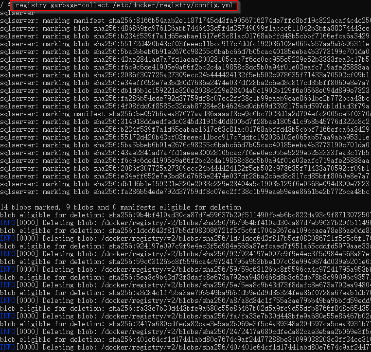

# 创建Docker私有库

[[TOC]]

## 创建容器

1. 拉取`Registry`私有库镜像

```
docker pull registry
```

2. 运行容器
   
   `\host_mnt\f\registry`表示的就是`F:/registry`

```bash
docker run -d -p 5000:5000 -v \host_mnt\f\registry:/var/lib/registry --name registry1 registry
```
## 提交本地镜像到私有库中

* 先将镜像打标签,在镜像名前添加私有库的名称`localhost:5000`

```bash
docker tag oracle/database:12.2.0.1-ee localhost:5000/oracle/database:12.2.0.1-ee
```

* 提交之前打过标签的带有私有库名的镜像

```bash
docker push localhost:5000/oracle/database:12.2.0.1-ee
```

## 删除库中的镜像

* 删除前查看库中的文件大小
    
    * 进入容器,执行`du -chs /var/lib/registry`
    * 可以看到库的大小为`3.0G`


* 如果有映射到宿主机目录，可以直接删除`repositories`目录下的镜像文件


* 进入容器，执行资源回收`registry garbage-collect /etc/docker/registry/config.yml`



* 再次查看库大小可以发现库的大小已经变小了


> [**Back**](Readme.md) <br /> *2019-03-17 by c-zero-f*