# 创建数据库

- 考虑是开发库所以不对数据库进行日志归档

- 使用 "Database Configuration Assistant"这个软件来创建数据库

    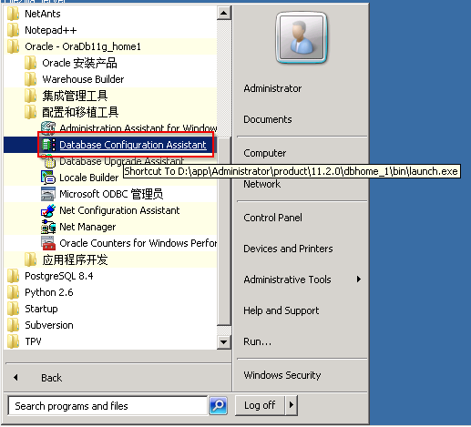
    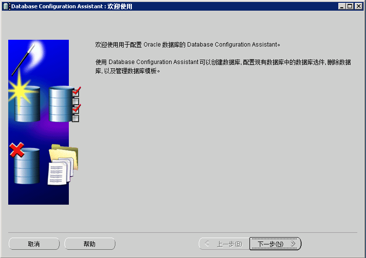
    
    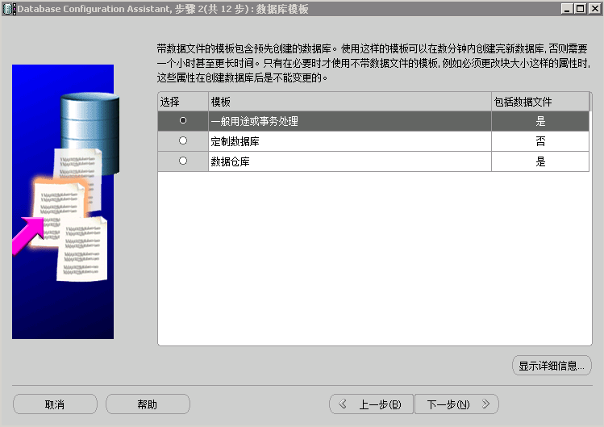
    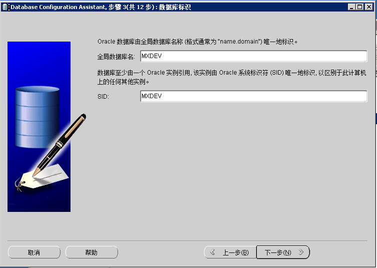
    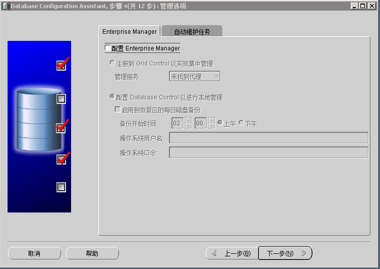
    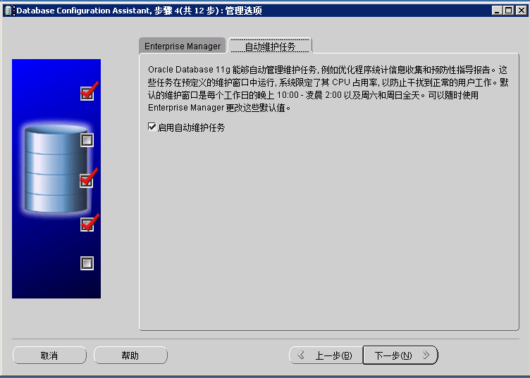

- 输入统一的密码，便于后续管理

    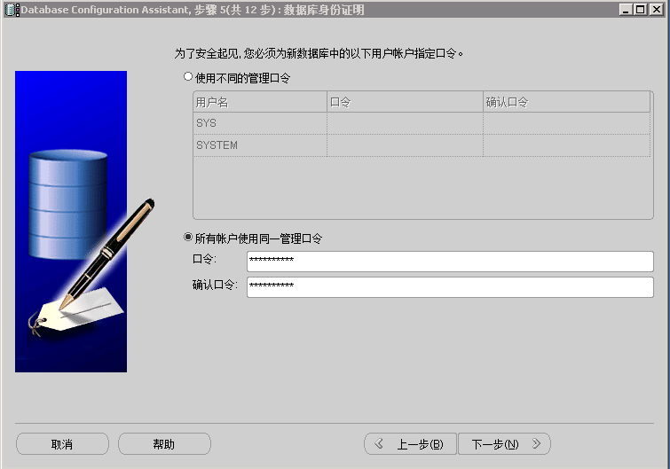
    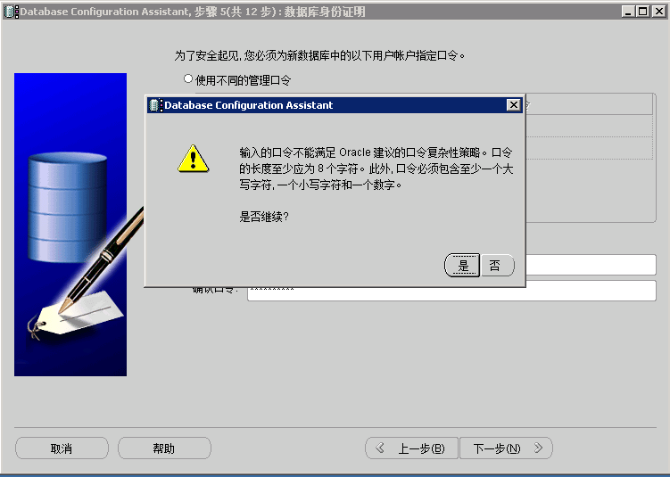

- 统一输入`E:\Oracle\{DB_NAME}\oradata`便于后续如果有创建多个数据库时，目录结构能够一致

    

- 统一输入`E:\Oracle\{DB_NAME}\fast_recovery_area`

    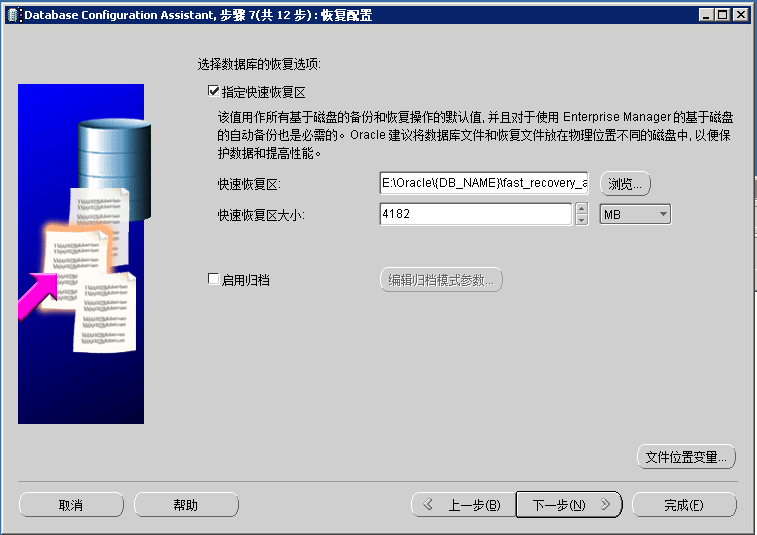
    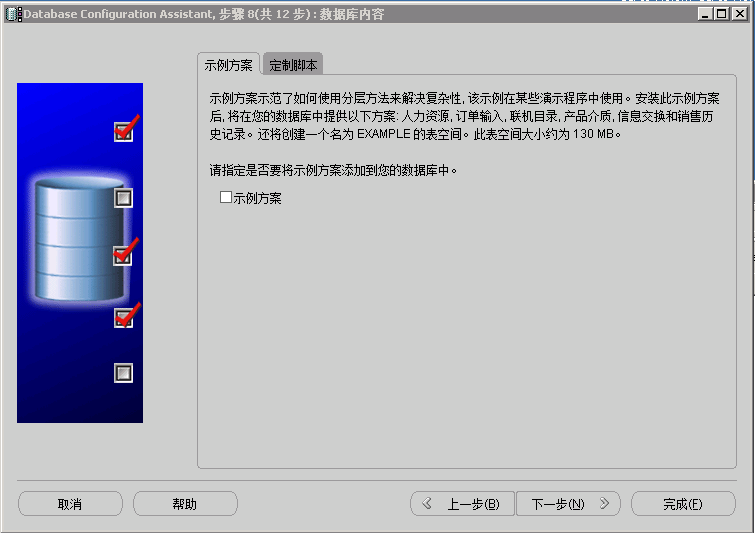
    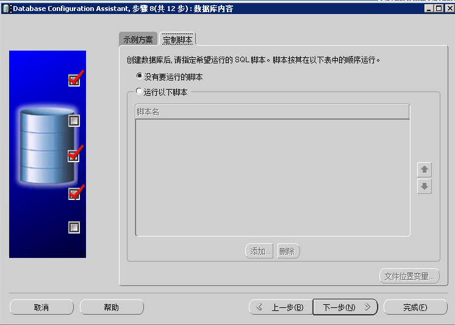
    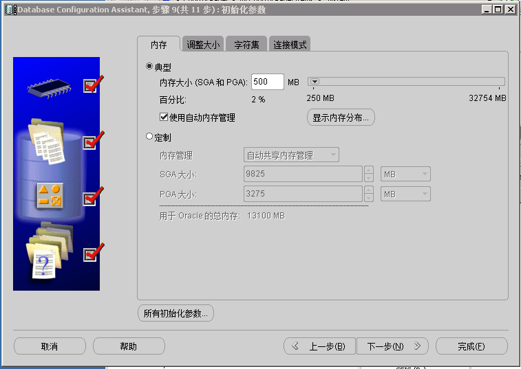
    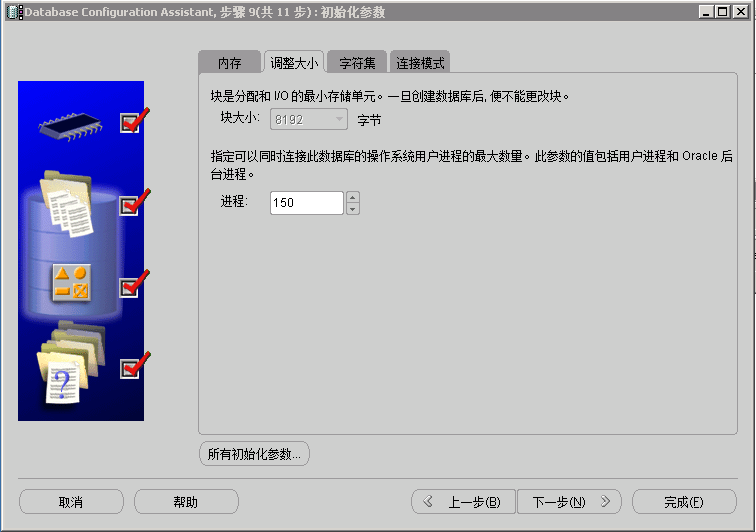
    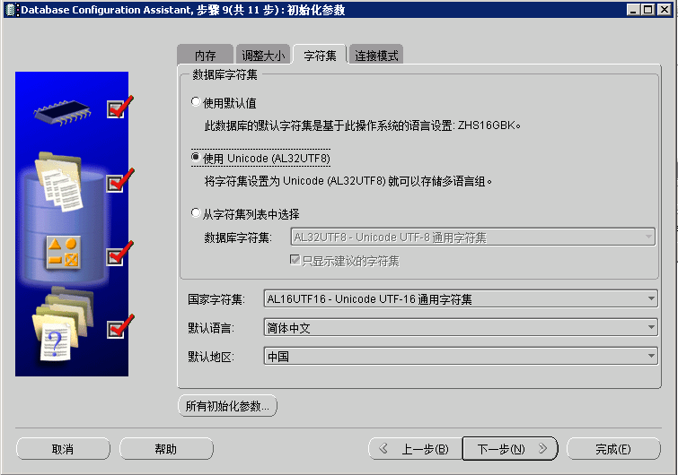
    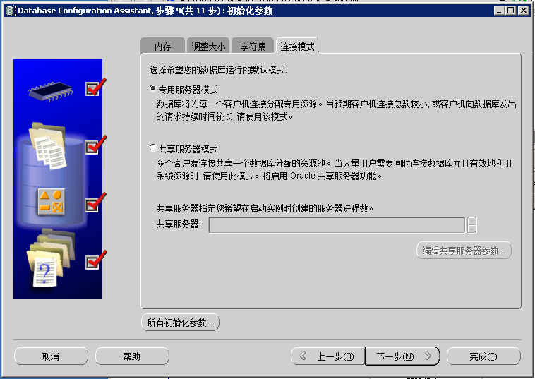
    
    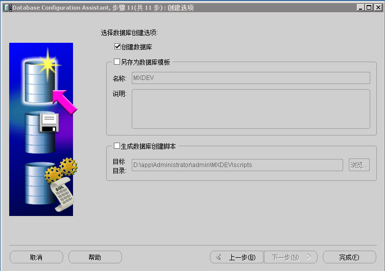
    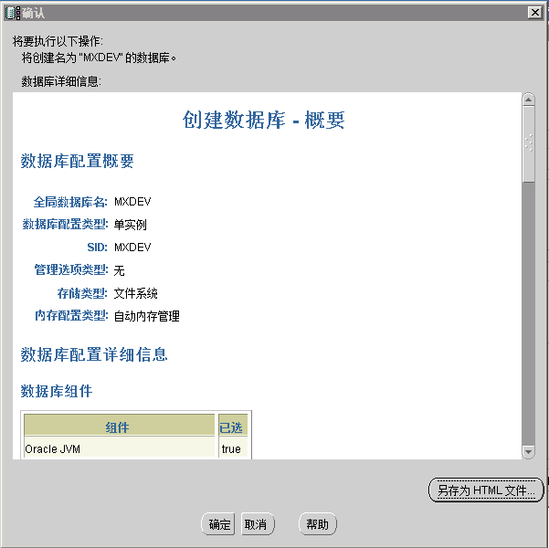
    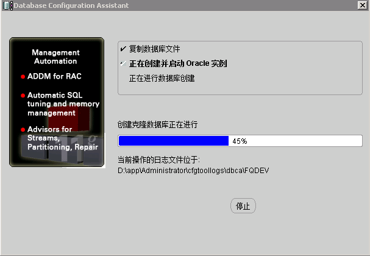
    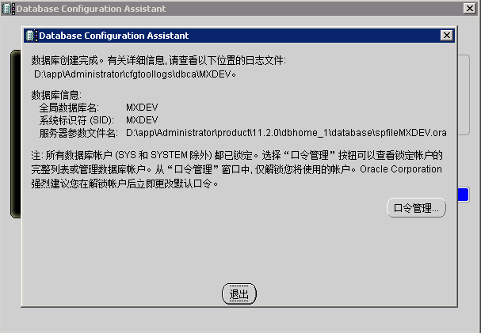

> [**Back**](Readme.md)   *2018-08-04 by c-zero-f*